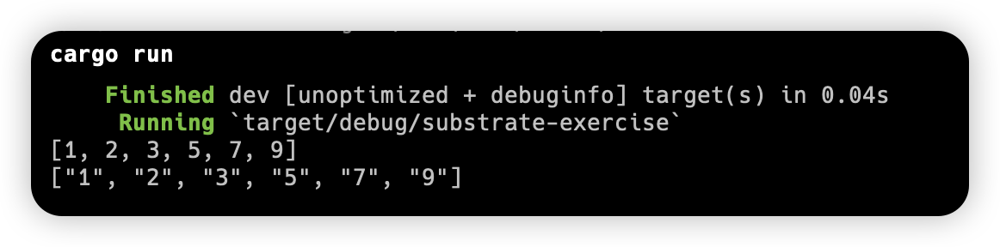

### 3rd Week Exercises
#### screenshot

#### code
```rust
// normal bubble sort
pub fn bubble_sort(mut nums: Vec<i32>) -> Vec<i32> {
    let len = nums.len();
    for i in 0..len {
        for j in 0..len - i - 1 {
            if nums[j] > nums[j + 1] {
                nums.swap(j, j + 1);
            }
        }
    }
    nums
}

// PartialOrd bubble sort
pub fn bubble_sort_paradigm<T: PartialOrd + Copy>(mut nums: Vec<T>) -> Vec<T> {
    let len = nums.len();
    for i in 0..len {
        for j in 0..len - i - 1 {
            if nums[j] > nums[j + 1] {
                nums.swap(j, j + 1);
            }
        }
    }
    nums
}
```
