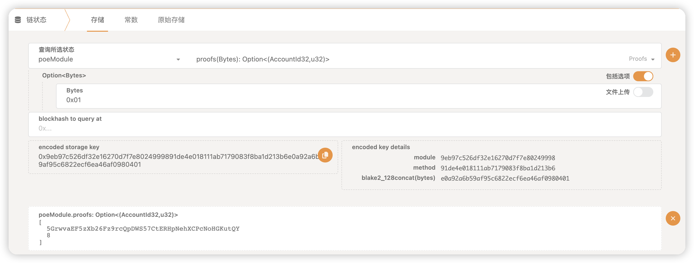

### 1. 实现存证模块的功能，包括：创建存证；撤销存证。
#### Code.
```rust
// 创建存证
#[pallet::call_index(0)]
        #[pallet::weight(0)]
        pub fn create_claim(
            origin: OriginFor<T>,
            claim: BoundedVec<u8, T::MaxClaimLength>,
        ) -> DispatchResult {
            let sender = ensure_signed(origin)?;

            ensure!(!Proofs::<T>::contains_key(&claim), Error::<T>::ProofAlreadyExist);
            ensure!(claim.len() <= T::MaxClaimLength::get() as usize, Error::<T>::ClaimTooLong);

            Proofs::<T>::insert(
                &claim,
                (sender.clone(), frame_system::Pallet::<T>::block_number()),
            );

            Self::deposit_event(Event::ClaimCreated(sender, claim));
            Ok(().into())
        }

// 撤销存证
#[pallet::call_index(1)]
        #[pallet::weight(0)]
        pub fn revoke_claim(
            origin: OriginFor<T>,
            claim: BoundedVec<u8, T::MaxClaimLength>,
        ) -> DispatchResultWithPostInfo {
            let sender = ensure_signed(origin)?;

            let (owner, _) = Proofs::<T>::get(&claim).ok_or(Error::<T>::ClaimNotExist)?;
            ensure!(owner == sender, Error::<T>::NotClaimOwner);

            Proofs::<T>::remove(&claim);

            Self::deposit_event(Event::ClaimRevoked(sender, claim));
            Ok(().into())
        }
```

#### Screenshot.
创建claim



撤销claim


### 2. 转移存证。
#### Code.
```rust
#[pallet::call_index(2)]
        #[pallet::weight(0)]
        pub fn transfer_claim(
            origin: OriginFor<T>,
            claim: BoundedVec<u8, T::MaxClaimLength>,
            dest: T::AccountId,
        ) -> DispatchResultWithPostInfo {
            let sender = ensure_signed(origin)?;

            let (owner, _) = Proofs::<T>::get(&claim).ok_or(Error::<T>::ClaimNotExist)?;
            ensure!(owner == sender, Error::<T>::NotClaimOwner);

            Proofs::<T>::insert(&claim, (dest.clone(), frame_system::Pallet::<T>::block_number()));

            Self::deposit_event(Event::ClaimCreated(dest, claim));
            Ok(().into())
        }
```

#### Screenshot.
转移claim


