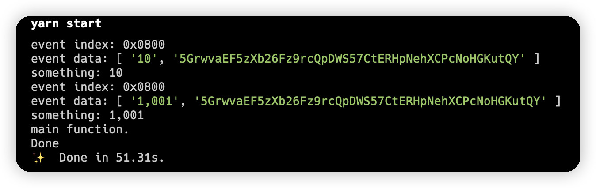

### Code
```typescript
import { ApiPromise, WsProvider } from "@polkadot/api"
import "@polkadot/api-augment"
const WEB_SOCKET = 'ws://localhost:9944'

const sleep = (ms: number) => new Promise((resolve) => setTimeout(resolve, ms))

const connect = async () => {
  const wsProvider = new WsProvider(WEB_SOCKET)
  const api = await ApiPromise.create({ provider: wsProvider, types: {

  } })
  await api.isReady
  return api
}
const getSomething = async (api: ApiPromise) => {
  await api.query.templateModule.something().then((data) => {
    console.log('something:', data.toHuman())
  })
}


const subscribe = async (api: ApiPromise) => {
  await api.query.system.events((events) => {
    events.forEach(function (event) {
      if (event['event']['section'] == 'templateModule' && event['event']['method'] == 'SomethingStored') {
        console.log('event index:', event['event']['index'].toHuman())
        console.log('event data:', event['event']['data'].toHuman())
        getSomething(api)
      }
    })
  })
}

const main = async () => {
  const api = await connect()
  await subscribe(api)
  await sleep(50000)
  console.log('main function.')
}

main().then(() => {
  console.log('Done')
  process.exit(0)
})
.catch((err) => {
  console.error(err)
  process.exit(1)
})
```

### Screenshot

